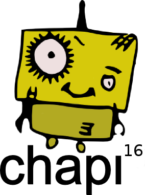

`Charlas para Profesores de Informática`

<chapi.canarias@gmail.com>

---

# El origen

Todos los años surge la necesidad de formarse. De aprender cosas nuevas
que sean útiles en nuestro trabajo. Algunos años hay dinero y se pueden
hacer cursos de formación y otros... no.

Pero incluso supongamos que:
* hay dinero
* que se hacen los cursos de formación
* que el ponente es un experto es su materia
* y además se da la circunstancia de que lo explica bien...

Aún así... falta algo. La mayoría de las veces... durante estos cursos de formación, las ideas más interesantes o los comentarios que nos abren nuevos caminos surgen en las charlas de cafetería que tenemos durante el descanso del curso.

Está bien que un experto nos explique HTML5 o JAVA pero...
* ¿eso cómo lo llevo al aula?
* ¿Cómo es la mejor forma de explicarlo?
* ¿Hago proyectos o exámenes teóricos? ...

Lo que falta es la visión de la práctica docente. Los expertos en eso...
somos nosotros mismos.

Entonces surge un pensamiento... ¿y si hacemos unas charlas formativas con
bajo presupuesto donde seamos los profesores los que explicamos a nuestros
compañeros algo nuevo o no tan nuevo que estemos haciendo actualmente y que hayamos aprendido recientemente y nos parezca interesante?...
Seguro que es muy útil conocer lo que están haciendo otros compañeros por
muchas razones:
* (A) _Orgulloso_: Me refuerza la idea de que lo que hago yo es mejor y lo sigo haciendo.
* (B) _Descubridor_: Oigo una forma nueva de hacer las cosas y eso me ayuda a trabajar de otra manera.
* (C) _Empático_: Expongo lo que hago para recibir un feedback o comentarios que puedan ayudarme a ver qué tal lo llevo.

---

# La primera piedra

Ese día tomando un café pensamos...
* ¿Y si hacemos que sea la charla de cafetería el propio curso de formación?
* ¿Y si lo hacemos con los compañeros?

Entonces surgió la idea de hacer unas *charlas de cafetería* llamadas...

**CHAPI**

`Charlas para profesores de Informática`

---

# Ediciones

| Año  | Lugar de celebración |
| ---- | -------------------- |
| 2016 | La primera charlas CHAPI en IES Puerto de la Cruz |
| 2017 | Se celebra en el IES el Rincón en Las Palmas de Gran Canaria |
| 2018 | Año de oposiciones... ¡no se organizó nada! |
| 2019 | Tenerife...en construcción |

**¿Cuando se celebrará la siguiente?** La fecha está casi decidida...
* La fecha definitiva se publicará en enero de 2019.
* Será al acabar el 2º trimestre.
* Un viernes, para que sea más cómodo a los compañeros que vienen de otras islas.

## Horario

Dependerá de la cantidad de ponentes que tengamos. Pero lo más probable
será:

| Hora          | Agenda   |
| ------------- | -------- |
| 10:00 - 13:00 | Charlas  |
| 13:20 - 14:40 | Almuerzo |
| 14:40 - 18:00 | Charlas  |
| 18:00 - 18:15 | Clausura |

---

# ¿Quién puede asistir?

Cualquier profesor de FP Informática que quiera. En Enero 2019 se abrirá el proceso de inscripción para los que estén interesados en asistir.

> Es importante controlar el número de personas que van a venir para encontrar la sala/aula adecuada.

Los compañeros que se desplacen de otras islas podrán consultar con la
coordinación de la familia profesional si existe alguna ayuda económica al transporte.

Además se entregará un certificado de asistencia para poder justificar
la salida del centro.

## Charlas/ponentes

En enero 2019 se publicarán los títulos de las charlas y los ponentes.
Cualquier interesado en ser ponente puede ponerse en contacto con nosotros.
